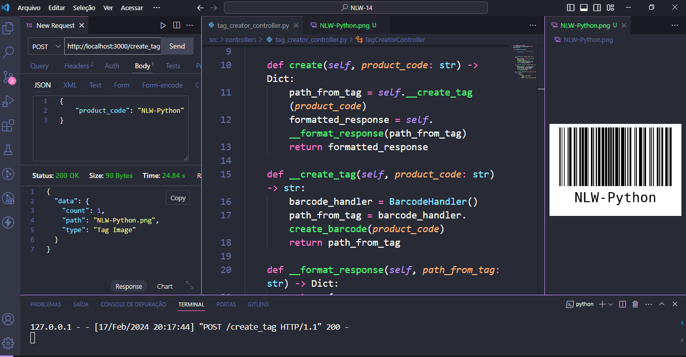

# Gerador de Tag Código de Barras

Este é um projeto Flask que cria tags de código de barrras em formato de imagem
utilizando o módulo `barcode`. O projeto possui uma estrutura de pastas organizada para lidar com solicitações HTTP, validação de dados, tratamento de erros e testes unitários.

## Tecnologias Utilizadas

Esse projeto utiliza as seguintes tecnologias:

### Flask

- é um framework web leve e flexível para Python. Ele é ideal para criar aplicativos web simples ou complexos de forma rápida e eficiente.

### python-barcode

- a biblioteca `python-barcode` permite a geração de diversos tipos de códigos de barras, como o Code128, que é utilizado neste projeto para criar as tags.

### cerberus

- `cerberus` é uma biblioteca de validação de dados para Python. Ela é usada neste projeto para validar os dados de entrada  recebidos nas solicitações HTTP, garantindo que apenas dados válidos sejam processsados.

### unittest

- O módulo `unittest` é uma estrutura de teste integrada ao Python. Ele é usado neste projeto para escrever e executar testes unitários, garantindo que as diferentes partes do código funcionem corretamente.

### Pylint

- É uma ferramenta de análise estática de código para Python. Ela verifica o código-fonte em busca de possíveis problemas, erros e violações de estilo, ajudando a manter um código limpo e de alta qualidade.

### pre-commit

- `pre-commit` é uma ferramenta que executa ganchos (hooks) automatizados antes de cada commit no git. Isso pode incluir verificação de estilo de código, formatação automática e execução de testes, garantindo que cada commit siga as diretrizes definidas para o projeto.

## Estrutura do projeto

- `src/`: Contém o código-fonte do projeto.
  - `controllers/`: Controladores responsáveis pela lógica de negócio.
  - `drivers/`: Classes para interação com drives externos, como o `barcode`, para geração de códigos de barras.
  - `main/`: Criação das rotas e servidor.
  - `errors/`: Definições de tipos de erro e tratamento de erros.
  - `validators/`: Validadores para validar os dados de entrada.
  - `views/`: Classes para interagir com solicitações HTTP.
  